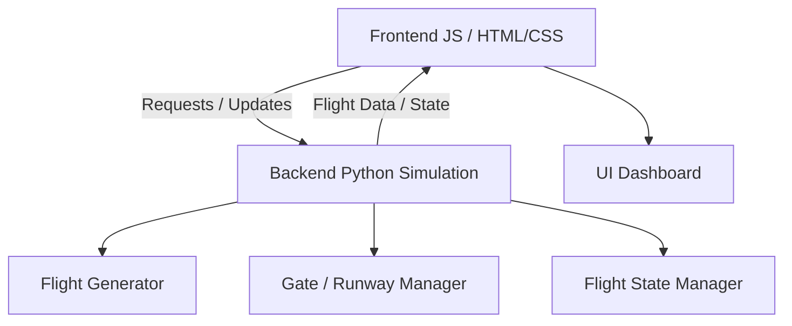
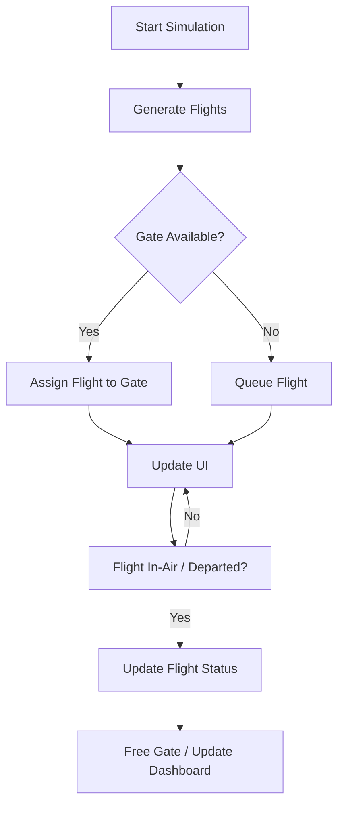

Perfect! Here’s a **full GitHub-ready README.md** for your **Airport Game** project with **Mermaid diagrams** (flowchart + architecture). You can copy-paste this directly into your repo.

---

# Airport Game ✈️

A web-based airport simulation game built with **JavaScript**, **HTML/CSS**, and **Python**.  
Simulates flight operations, airport resources, and passenger flow in real-time.

---

## Table of Contents

1. [Overview](#overview)  
2. [Features](#features)  
3. [Architecture & Tech Stack](#architecture--tech-stack)  
4. [Getting Started](#getting-started)  
   - [Prerequisites](#prerequisites)  
   - [Installation](#installation)  
   - [Running the Game](#running-the-game)  
5. [Usage](#usage)  
6. [Project Structure](#project-structure)  
7. [How It Works](#how-it-works)  
8. [Architecture Diagram](#architecture-diagram)  
9. [Flow Diagram](#flow-diagram)  
10. [Extending / Contributing](#extending--contributing)  
11. [Known Issues / Limitations](#known-issues--limitations)  
12. [Future Improvements](#future-improvements)  
13. [License](#license)  

---

## Overview

**Airport Game** simulates airport operations in a web app using JavaScript for the frontend and Python for backend logic.  
It models flights, airport resources, and passenger flow, providing an interactive simulation environment.

---

## Features

- Flight scheduling and simulation in real-time  
- Airport dashboard UI showing arrivals, departures, and gate usage  
- Interactive simulation: add/remove flights, start/pause simulation  
- Backend Python logic for flight generation, timing, and state management  
- Frontend updates dynamically using JavaScript  

---

## Architecture & Tech Stack

- **Frontend:** JavaScript (ES6+), HTML, CSS  
- **Backend:** Python (simulation logic)  
- **Communication:** HTTP requests or WebSockets for real-time updates  
- **Optional Tools:** Node.js, npm, pip  

---

## Getting Started

### Prerequisites

- Node.js (frontend)  
- Python 3.x (backend)  
- Terminal / command-line environment  

### Installation

```bash
git clone https://github.com/taifjalo/airport-game.git
cd airport-game
````

* Backend dependencies:

```bash
cd backend
pip install -r requirements.txt
```

* Frontend dependencies (if using npm):

```bash
cd ../frontend
npm install
```

### Running the Game

* **Backend:**

```bash
cd backend
python app.py  # Or your Python entry point
```

* **Frontend:**

```bash
cd ../frontend
npm start  # Or `npm run dev` depending on setup
```

Open your browser at `http://localhost:3000` (or your configured port).

---

## Usage

1. Start backend and frontend
2. Begin simulation on the UI
3. Observe flights arriving, departing, and gate usage
4. Interact: add flights, pause simulation, monitor airport state
5. UI updates dynamically with backend simulation data

---

## Project Structure

```
airport-game/
├── backend/               # Python backend for simulation
│   ├── app.py
│   ├── simulation.py
│   └── requirements.txt
├── frontend/              # JS + HTML + CSS frontend
│   ├── index.html
│   ├── styles.css
│   ├── js/
│   │   └── main.js
│   └── package.json
└── README.md
```

---

## How It Works

1. **Backend Python Simulation:** Generates flights, updates status (arrived, in-air, departed), manages gates
2. **Frontend JavaScript UI:** Requests backend state and updates visual dashboard
3. **User Interaction:** Add flights, start/pause simulation, monitor gate availability
4. **Real-Time Updates:** UI reflects changes as backend simulation progresses

---

## Architecture Diagram



---

## Flow Diagram



---

## Extending / Contributing

* Add realistic flight behavior: delays, emergencies, weather
* Passenger simulation: boarding, baggage handling
* Advanced UI: animations, drag-and-drop gates
* WebSocket support for true real-time updates
* Persistent storage (database) for saving and resuming simulation
* Contribute: Fork → branch → commit → pull request

---

## Known Issues / Limitations

* Limited simulation logic
* UI may not scale with many flights
* No persistence, simulation resets on refresh
* Backend performance may degrade with large-scale simulations

---

## Future Improvements

* Flight metrics dashboard (wait times, gate usage)
* WebSocket integration for real-time interactivity
* Passenger simulation and staff management
* Save/load simulation state
* Enhanced UI with charts, animations, and notifications

---

## License

Currently unlicensed. Consider adding **MIT** or **Apache 2.0** license.

---

## Screenshots / Demo

> *Add screenshots or a demo GIF here to showcase the game*
> Example:
> 
Do you want me to do that next?
```
